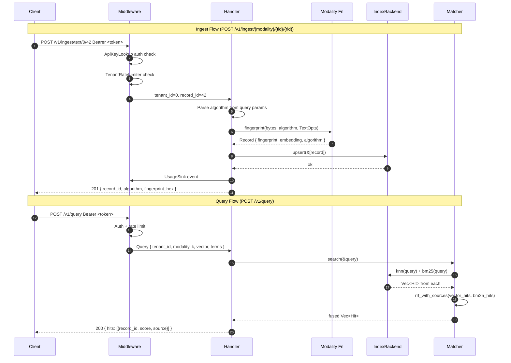
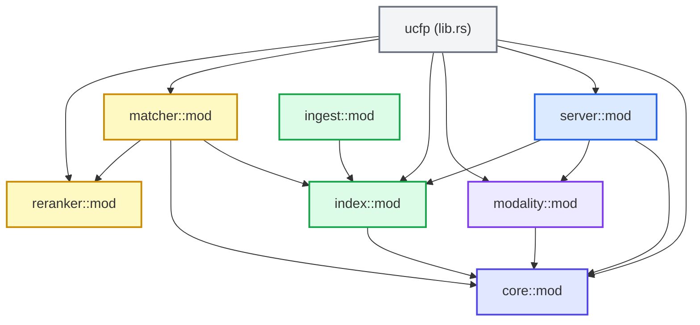

# UCFP Architecture

## System Architecture Diagram

```mermaid
flowchart TB
    classDef client fill:#fef3c7,stroke:#d97706,stroke-width:2px,color:#78350f
    classDef server fill:#dbeafe,stroke:#2563eb,stroke-width:2px,color:#1e3a8a
    classDef middleware fill:#e0e7ff,stroke:#4f46e5,stroke-width:2px,color:#312e81
    classDef algo   fill:#ede9fe,stroke:#7c3aed,stroke-width:2px,color:#4c1d95
    classDef text   fill:#fce7f3,stroke:#db2777,stroke-width:2px,color:#831843
    classDef image  fill:#d1fae5,stroke:#059669,stroke-width:2px,color:#064e3b
    classDef audio  fill:#fed7aa,stroke:#ea580c,stroke-width:2px,color:#7c2d12
    classDef store  fill:#dcfce7,stroke:#16a34a,stroke-width:2px,color:#14532d
    classDef matcher fill:#fef9c3,stroke:#ca8a04,stroke-width:2px,color:#713f12

    Client([HTTP Client]):::client

    subgraph Server["Server (axum) - src/server/"]
        direction TB
        Auth["Auth Middleware\n(ApiKeyLookup)"]:::middleware
        RateLimit["Rate Limiter\n(TenantRateLimiter)"]:::middleware
        Usage["Usage Sink\n(UsageSink)"]:::middleware
        Routes["REST Handlers\n(handlers.rs)"]:::server
        DTO["DTOs\n(dto.rs)"]:::server
        AlgoManifest["Algorithms Manifest\n(algorithms_manifest.rs)"]:::server
        
        Auth --> RateLimit
        RateLimit --> Routes
        Routes --> Usage
        Routes --> DTO
        Routes -.-> AlgoManifest
    end

    subgraph Core["Core Types - src/core/"]
        Record["Record\n(tenant_id, record_id,\nfingerprint, embedding)"]:::server
        Modality["Modality\n(Text/Image/Audio)"]:::server
        Query["Query\n(vector, terms, filter)"]:::server
        Hit["Hit\n(score, source)"]:::server
    end

    subgraph Modality["Modality Pipeline - src/modality/"]
        direction TB
        
        subgraph Text["Text - text.rs"]
            direction TB
            MinHash["MinHash\n(H=128)"]:::text
            SimHash["SimHash\n(TF / IDF)"]:::text
            LSH["LSH\n(band-partitioned)"]:::text
            TLSH["TLSH\n(Trend Micro)"]:::text
            TextSemantic["Semantic\n(OpenAI/Voyage/Cohere/Local)"]:::text
            TextStream["Streaming MinHash"]:::text
            TextPreproc["Preprocessing\n(HTML/Markdown/PDF)"]:::text
        end
        
        subgraph Image["Image - image.rs"]
            direction TB
            MultiHash["MultiHash\n(PHash+DHash+AHash)"]:::image
            PHash["PHash\n(DCT)"]:::image
            DHash["DHash\n(gradient)"]:::image
            AHash["AHash\n(mean)"]:::image
            ImageSemantic["Semantic\n(CLIP ONNX)"]:::image
        end
        
        subgraph Audio["Audio - audio.rs"]
            direction TB
            Wang["Wang\n(landmark)"]:::audio
            Panako["Panako\n(triplet)"]:::audio
            Haitsma["Haitsma\n(robust hash)"]:::audio
            Neural["Neural\n(log-mel ONNX)"]:::audio
            Watermark["Watermark\n(AudioSeal)"]:::audio
            AudioStream["Streaming Wang"]:::audio
        end
    end

    subgraph Index["Index Backend - src/index/"]
        direction TB
        Trait["IndexBackend trait\n(upsert/delete/knn/bm25)"]:::store
        
        subgraph Embedded["EmbeddedBackend - embedded/"]
            direction TB
            RedB["redb Tables\n(fingerprints/vectors/catalog)"]:::store
            KNN["Brute-force Cosine K-NN"]:::store
            BM25["BM25\n(FST + roaring postings)"]:::store
            HNSW["HNSW\n(deferred ≥1M vectors)"]:::store
        end
    end

    subgraph Matcher["Matcher - src/matcher/"]
        direction TB
        RRF["RRF Fusion\n(Reciprocal Rank Fusion)"]:::matcher
        Hybrid["Hybrid Search\n(vector ∥ BM25)"]:::matcher
    end

    subgraph Rerank["Reranker - src/rerank/"]
        RerankerTrait["Reranker trait\n(cross-encoder)"]:::matcher
        NoopRerank["NoopReranker"]:::matcher
    end

    Client ==>|HTTP POST/GET| Auth
    Routes --> Record
    Routes --> Modality
    Routes --> Query
    
    Routes --> Text
    Routes --> Image
    Routes --> Audio
    
    Text --> Trait
    Image --> Trait
    Audio --> Trait
    
    Text --> Core
    Image --> Core
    Audio --> Core
    
    Trait --> RedB
    Trait --> KNN
    Trait --> BM25
    
    Query --> Matcher
    Trait --> Matcher
    Matcher --> RRF
    Matcher --> Hybrid
    Matcher --> RerankerTrait
    
    Routes ==>|JSON Response| Client
```



## Request Flow Sequence Diagram



## Module Dependency Graph



## Key Data Structures

| Structure | Location | Purpose |
|-----------|----------|---------|
| `Record` | `src/core/mod.rs` | Fingerprint + embedding + metadata |
| `Modality` | `src/core/mod.rs` | Text / Image / Audio enum |
| `Query` | `src/core/mod.rs` | Search query (vector + terms + filter) |
| `Hit` | `src/core/mod.rs` | Search result with score and source |
| `HitSource` | `src/core/mod.rs` | Vector / BM25 / Filter / Reranker / Fused |
| `IndexBackend` | `src/index/mod.rs` | Trait for storage backends |
| `EmbeddedBackend` | `src/index/embedded/mod.rs` | redb implementation |
| `Matcher` | `src/matcher/mod.rs` | Orchestrates retrieval + RRF |
| `Reranker` | `src/reranker/mod.rs` | Trait for result reranking |
| `ServerState` | `src/server/mod.rs` | Axum app state (index + auth + rate + usage) |
| `ApiKeyLookup` | `src/server/apikey.rs` | Trait for auth sources |
| `TenantRateLimiter` | `src/server/ratelimit.rs` | Trait for rate limiting |
| `UsageSink` | `src/server/usage.rs` | Trait for usage tracking |

## Feature Flags → Modules Mapping

| Feature Flag | Module | Algorithms |
|--------------|--------|------------|
| `text` | `modality/text.rs` | MinHash (default) |
| `text-simhash` | `modality/text.rs` | SimHash (TF / IDF) |
| `text-lsh` | `modality/text.rs` | LSH |
| `text-tlsh` | `modality/text.rs` | TLSH |
| `text-semantic-local` | `modality/text.rs` | Local ONNX embeddings |
| `text-semantic-openai` | `modality/text.rs` | OpenAI API |
| `text-semantic-voyage` | `modality/text.rs` | Voyage API |
| `text-semantic-cohere` | `modality/text.rs` | Cohere API |
| `text-streaming` | `modality/text.rs` | Streaming MinHash |
| `text-markup` | `modality/text.rs` | HTML→text |
| `text-pdf` | `modality/text.rs` | PDF→text |
| `image` | `modality/image.rs` | MultiHash (default) |
| `image-perceptual` | `modality/image.rs` | PHash, DHash, AHash |
| `image-semantic` | `modality/image.rs` | CLIP ONNX |
| `audio` | `modality/audio.rs` | Wang (default) |
| `audio-panako` | `modality/audio.rs` | Panako |
| `audio-haitsma` | `modality/audio.rs` | Haitsma |
| `audio-neural` | `modality/audio.rs` | Neural ONNX |
| `audio-watermark` | `modality/audio.rs` | AudioSeal |
| `audio-streaming` | `modality/audio.rs` | Streaming Wang |
| `embedded` | `index/embedded/` | redb backend |
| `server` | `server/` | HTTP server |
| `multi-tenant` | `server/apikey.rs` | Multi-tenant auth |
| `multipart` | `server/handlers.rs` | Multipart upload |

## Storage Layout (redb)

```
ucfp.redb
├── fingerprints  (tenant_id: u32, record_id: u64) → bytes (bytemuck-cast SDK fingerprint)
├── metadata      (tenant_id: u32, record_id: u64) → bytes (application metadata)
├── vectors       (tenant_id: u32, record_id: u64) → f32 array (raw little-endian)
├── catalog       (tenant_id: u32, record_id: u64) → JSON (algorithm, fmt_ver, config_hash)
├── bm25_terms    FST<str> → (offset: u64, len: u32)  (term dictionary)
├── bm25_postings (term_offset, doc_tenant, doc_id) → roaring bitmap (postings lists)
└── bm25_scoring  (tenant_id, record_id) → (doc_len: u32, avg_field_len: f32)
```
