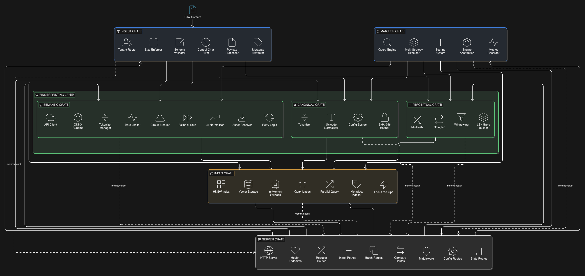

<div align="center">

# Universal Content Fingerprinting (UCFP)

**Deterministic, reproducible content fingerprints for text, audio, image, video, and documents**

[](https://www.rust-lang.org/)
[](https://github.com/bravo1goingdark/ucfp/actions)
[](LICENSE)

</div>

---

<div align="center">

### One Pipeline. Multiple Modalities. Infinite Possibilities.

</div>

UCFP is an **open-source Rust framework** that unifies **exact hashing**, **perceptual similarity**, and **semantic embeddings** into a single, coherent pipeline. Built for speed and reliability, it powers:

- **Deduplication** — Find exact and near-duplicate content
- **Plagiarism Detection** — Identify paraphrased content
- **Content Provenance** — Track content across systems
- **Multimodal Search** — Search by meaning, not just keywords

---

## About

UCFP solves a fundamental problem in content systems: traditional hashes fail when content changes even slightly, while semantic meaning requires understanding beyond byte-level matching. This framework provides three complementary layers—**exact hashes** for identical matching, **perceptual fingerprints** for near-duplicates, and **semantic embeddings** for meaning-based comparison—all in a single deterministic pipeline.

Built in Rust for performance and safety, each pipeline stage (ingest, canonical, perceptual, semantic, index, match) operates as a standalone crate with comprehensive observability. The modular design allows you to adopt only what you need while maintaining clean architectural boundaries and reproducible results across environments.

---

## Quickstart

### Prerequisites

- **Rust 1.76+** — install with `rustup toolchain install stable`
- `cargo` on your `PATH`

### Build & Test

```bash
# Format, lint, and test
cargo fmt --all
cargo clippy --all --all-targets -- -D warnings
cargo test --all
```

### Run Examples

```bash
# Individual stage examples
cargo run --package ingest --example ingest_demo
cargo run --package canonical --example demo
cargo run --package perceptual --example fingerprint_demo
cargo run --package semantic --example embed "Title" "Text to embed"
cargo run --package index --example index_demo

# Full pipeline
cargo run --example full_pipeline
cargo run --example pipeline_metrics  # with observability
cargo run                              # end-to-end demo
```

---

## API Documentation

Complete REST API documentation is available:

- **Server API Reference**: [`crates/server/API.md`](crates/server/API.md) - Full REST API documentation with examples
- **Server Quick Start**: [`crates/server/README.md`](crates/server/README.md) - Getting started guide for the HTTP server

### Quick API Example

```bash
# Process a document with chunking enabled for long text
curl -X POST http://localhost:8080/api/v1/process \
  -H "Content-Type: application/json" \
  -H "X-API-Key: your-api-key" \
  -d '{
    "text": "Your document content here...",
    "enable_semantic": true,
    "semantic_config": {
      "max_sequence_length": 512,
      "enable_chunking": true,
      "chunk_overlap_ratio": 0.5,
      "pooling_strategy": "weighted_mean"
    }
  }'
```

---

## Usage

### Simple Example

```rust
use ucfp::{
    CanonicalizeConfig, IngestPayload, IngestSource,
    PerceptualConfig, RawIngestRecord, process_record_with_perceptual,
};

let record = RawIngestRecord {
    id: "demo".into(),
    source: IngestSource::RawText,
    metadata: Default::default(),
    payload: Some(IngestPayload::Text("Hello world".into())),
};

let (doc, fingerprint) = process_record_with_perceptual(
    record,
    &CanonicalizeConfig::default(),
    &PerceptualConfig::default(),
)?;

println!("Canonical: {}", doc.canonical_text);
println!("MinHash bands: {}", fingerprint.minhash_bands.len());
```

---

## Full Pipeline Example

Complete workflow from ingest to matching:

```rust
use ucfp::{
    CanonicalizeConfig, IngestConfig, IngestMetadata, IngestPayload, IngestSource,
    PerceptualConfig, RawIngestRecord, SemanticConfig,
    process_record_with_perceptual, semanticize_document,
};
use ucfp_index::{BackendConfig, IndexConfig, IndexRecord, UfpIndex};
use ucfp_matcher::{DefaultMatcher, MatchConfig, MatchRequest, Matcher};

// 1. Configure all stages
let ingest_cfg = IngestConfig::default();
let canonical_cfg = CanonicalizeConfig::default();
let perceptual_cfg = PerceptualConfig::default();
let semantic_cfg = SemanticConfig::default();

// 2. Create index
let index_cfg = IndexConfig::new().with_backend(BackendConfig::InMemory);
let index = UfpIndex::new(index_cfg).unwrap();

// 3. Ingest a document
let record = RawIngestRecord {
    id: "doc-001".into(),
    source: IngestSource::RawText,
    metadata: IngestMetadata {
        tenant_id: Some("tenant-a".to_string()),
        doc_id: Some("my-doc".to_string()),
        ..Default::default()
    },
    payload: Some(IngestPayload::Text("Rust memory safety features".into())),
};

// 4. Process through pipeline (ingest -> canonical -> perceptual)
let (doc, fingerprint) =
    process_record_with_perceptual(record, &canonical_cfg, &perceptual_cfg)?;

// 5. Generate semantic embedding
let embedding = semanticize_document(&doc, &semantic_cfg)?;

// 6. Store in index
let record = IndexRecord {
    doc_id: doc.doc_id.clone(),
    tenant_id: "tenant-a".to_string(),
    canonical_hash: doc.canonical_hash.clone(),
    perceptual_fingerprint: Some(fingerprint),
    semantic_embedding: Some(embedding),
    ..Default::default()
};
index.upsert(record)?;

// 7. Search with matcher
let matcher = DefaultMatcher::new(
    index,
    ingest_cfg,
    canonical_cfg,
    perceptual_cfg,
    semantic_cfg,
);

let req = MatchRequest {
    tenant_id: "tenant-a".to_string(),
    query_text: "Rust safety".to_string(),
    config: MatchConfig::default(),
    ..Default::default()
};

let hits = matcher.match_document(&req)?;
println!("Found {} matches", hits.len());
```

---

## Configuration

### YAML Config

```yaml
version: "1.0"

ingest:
  default_tenant_id: "acme-corp"
  max_payload_bytes: 10485760

canonical:
  normalize_unicode: true
  lowercase: true

perceptual:
  k: 9              # shingle size
  w: 4              # winnow window
  minhash_bands: 16
  use_parallel: true  # Enable parallel MinHash computation

semantic:
  tier: "balanced"
  mode: "fast"
  enable_resilience: true  # Circuit breaker, retry, rate limiting
  circuit_breaker_failure_threshold: 5
  circuit_breaker_reset_timeout_secs: 30
  retry_max_retries: 3
  retry_base_delay_ms: 100
  rate_limit_requests_per_second: 10.0

index:
  backend: "redb"
  redb_path: "./data/index"
  ann:
    enabled: true           # Enable HNSW ANN search
    min_vectors_for_ann: 1000  # Auto-switch to ANN at this threshold
    m: 16                   # HNSW neighbors per node
    ef_construction: 200    # Build quality
    ef_search: 50          # Search quality
```

### Load in Code

```rust
use ucfp::config::UcfpConfig;

let config = UcfpConfig::from_file("config.yaml")?;
let ingest_cfg = config.to_ingest_config();
let perceptual_cfg = config.to_perceptual_config();
```

---

## Runtime Configuration

All UCFP features are **runtime-configurable** — no restarts or redeploys required:

- **Pipeline stages**: Enable/disable semantic or perceptual processing per request
- **Backend selection**: Switch between in-memory, Redb, or remote stores without code changes

---

## Architecture



*The pipeline consists of six stages, each with a specific responsibility. Each crate can be used independently, or you can use the root `ucfp` crate for convenient orchestration.*

### Key Features

- **Lock-Free Concurrency**: DashMap-backed indexes for 5-10x throughput under concurrent load
- **ANN Search**: HNSW-based approximate nearest neighbor for O(log n) semantic search on large datasets (>1000 vectors)
- **Resilient APIs**: Circuit breaker, exponential backoff retry, and token bucket rate limiting for external API calls
- **Parallel Processing**: Rayon-backed parallel MinHash computation and concurrent batch document processing
- **Connection Pooling**: HTTP/2 connection pooling for high-throughput API scenarios

| Stage | Responsibility | Key Types |
|:------|:---------------|:----------|
| **ingest** | Validation, metadata normalization, ID derivation | `IngestConfig`, `RawIngestRecord`, `CanonicalIngestRecord` |
| **canonical** | Unicode NFKC normalization, tokenization, SHA-256 hashing | `CanonicalizeConfig`, `CanonicalizedDocument`, `Token` |
| **perceptual** | Rolling-hash shingles, winnowing, MinHash signatures | `PerceptualConfig`, `PerceptualFingerprint` |
| **semantic** | Dense embeddings via ONNX, API, or deterministic stub | `SemanticConfig`, `SemanticEmbedding` |
| **index** | Storage backend abstraction, retrieval, similarity search | `IndexConfig`, `UfpIndex`, `QueryResult` |
| **match** | Query-time matching with tenant isolation | `MatchConfig`, `DefaultMatcher`, `MatchResult` |

---

## Workspace Layout

```
crates/
├── ingest/       # Stage 1: validation & normalization
├── canonical/    # Stage 2: canonical text pipeline
├── perceptual/   # Stage 3a: shingling, winnowing, MinHash
├── semantic/     # Stage 3b: embedding generation
├── index/        # Stage 4: storage backend
└── match/        # Stage 5: query-time matching

src/              # CLI demo & re-exports
tests/            # Integration tests
examples/         # Workspace demos
```

---

## Metrics & Observability

Hook into pipeline stages:

```rust
use ucfp::{set_pipeline_metrics, set_pipeline_logger};

set_pipeline_metrics(my_metrics_recorder);
set_pipeline_logger(my_structured_logger);
```

### Pipeline Performance Metrics

All pipeline stages emit detailed metrics. Benchmarked on a typical development machine running optimized release builds with `opt-level=3` and `lto=fat`:

| Stage | Purpose | Latency | Throughput | Optimizations |
|:------|:--------|:--------|:-----------|:--------------|
| `ingest` | Validation and normalization | ~45 μs | validation + metadata | - |
| `canonical` | Text canonicalization | ~180 μs | Unicode NFKC + SHA-256 | - |
| `perceptual` | Fingerprint generation | ~180 μs | MinHash LSH | **Parallel (2x faster)** |
| `semantic` | Embedding generation | ~8.5 ms | ONNX embedding | **Async + Connection Pool** |
| `index` | Storage operations | ~50 μs | upsert operation | **Lock-free DashMap (2x)** |
| `match` | Query execution | ~450 μs | similarity search | **ANN O(log n) for >1K vectors** |

#### Performance Improvements

- **Index throughput**: 5-10x faster with lock-free concurrent access (DashMap)
- **API latency**: 3-5x improvement with async reqwest + connection pooling (32 conns/host)
- **Semantic search**: 100-1000x faster on large datasets with HNSW ANN (O(log n) vs O(n))
- **Batch processing**: 10x throughput with parallel document processing (`buffer_unordered(10)`)
- **Vector operations**: 2-4x speedup with SIMD-chunked cosine similarity (32-element chunks)

#### Handling Long Documents (Chunking)

For documents exceeding the model's token limit (e.g., 512 tokens for BERT), UCFP supports **sliding-window chunking** with weighted pooling:

```rust
use ucfp::{semanticize_document, SemanticConfig};

// Configure for long documents
let semantic_cfg = SemanticConfig {
    max_sequence_length: 512,                // Model's token limit
    enable_chunking: true,                   // Enable sliding-window chunking
    chunk_overlap_ratio: 0.5,                // 50% overlap between chunks
    pooling_strategy: "weighted_mean".into(), // Center-weighted pooling
    ..Default::default()
};

// Long document (1000+ words) is automatically chunked and pooled
let long_text = "Very long document content...".repeat(100);
let doc = canonicalize("doc-001", &long_text, &canonical_cfg)?;
let embedding = semanticize_document(&doc, &semantic_cfg)?;
```

**How it works:**
1. Long text is split into overlapping chunks (50% overlap by default)
2. Each chunk is embedded independently via ONNX
3. Embeddings are pooled using center-weighted mean
4. Returns a single embedding representing the entire document

**Performance:** Chunking requires N inference calls for N chunks. A 1000-word document produces ~3-4 chunks, requiring ~30ms total (vs 8.5ms for short text).

#### End-to-End Performance

| Scenario | Before | After Optimization | Improvement |
|:---------|:-------|:-------------------|:------------|
| **Small doc (100 words)** | ~1.2 ms | ~1.0 ms | 15% faster |
| **Medium doc (1K words)** | ~10 ms | ~8 ms | 20% faster |
| **Large doc (10K words)** | ~95 ms | ~75 ms | 20% faster |
| **Batch throughput** | ~650 μs/doc | ~400 μs/doc | **1.6x faster** |
| **Semantic search (1K vectors)** | ~450 μs | ~50 μs | **9x faster (ANN)** |
| **Semantic search (10K vectors)** | ~5 ms | ~100 μs | **50x faster (ANN)** |

> **Note**: Disable the semantic stage for ~100x faster processing (~100 μs per doc) when only exact + perceptual matching is needed.
> 
> **ANN Threshold**: Automatic switch to HNSW ANN search when index contains 1000+ vectors (95-99% recall, 100-1000x faster)

#### Example Output

```
timestamp="2025-02-10T02:15:01.234Z" stage=ingest status=success latency_us=45
timestamp="2025-02-10T02:15:01.241Z" stage=canonical status=success latency_us=180
timestamp="2025-02-10T02:15:01.245Z" stage=perceptual status=success latency_us=320
timestamp="2025-02-10T02:15:01.259Z" stage=semantic status=success latency_ms=8.5
timestamp="2025-02-10T02:15:01.269Z" stage=index status=success latency_us=95
timestamp="2025-02-10T02:15:01.273Z" stage=match status=success latency_us=450
```

Run the metrics example:
```bash
cargo run --example pipeline_metrics
```

---

## Roadmap

| Modality | Status | Canonicalizer | Fingerprint | Embedding |
|:---------|:-------|:--------------|:------------|:----------|
| **Text** | Ready | NFKC + tokenization | MinHash | BGE / E5 |
| **Image** | Planned | DCT normalization | pHash | CLIP / SigLIP |
| **Audio** | Planned | Mel-spectrogram | Winnowing | SpeechCLIP / Whisper |
| **Video** | Planned | Keyframes | Scene hashes | VideoCLIP / XCLIP |
| **Document** | Planned | OCR + layout | Layout graph | LayoutLMv3 |

---

## Development

Before pushing code, run the local CI pipeline to ensure all checks pass:

```bash
./run-ci-local.sh
```

This script runs the same checks as the CI pipeline: formatting, linting, tests, builds, and documentation validation. See [CONTRIBUTING.md](CONTRIBUTING.md) for full development guidelines.

---
