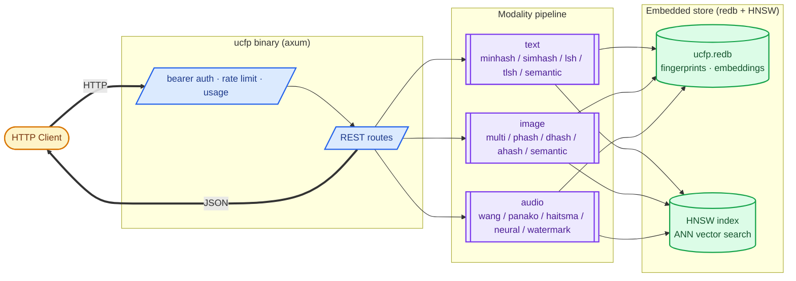
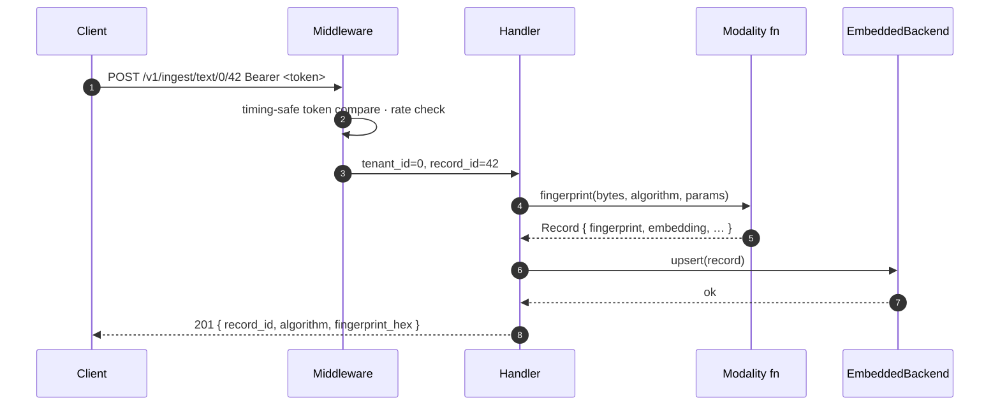

<div align="center">

# Universal Content Fingerprinting (UCFP)

**Deterministic, reproducible content fingerprints for text, audio, and image — served over HTTP**

[](https://www.rust-lang.org/)
[](https://github.com/bravo1goingdark/ucfp/actions)
[](LICENSE)

</div>

UCFP is a single Rust binary that fingerprints text, image, and audio content and stores the results in an embedded database. Clients submit raw content over HTTP and get back a compact, stable fingerprint they can store and compare.

- **Deduplication** — find exact and near-duplicate content across modalities
- **Plagiarism Detection** — identify paraphrased or transcoded copies
- **Content Provenance** — track content as it moves through systems
- **Similarity Search** — query by fingerprint to retrieve approximate matches

## Quickstart

**Prerequisites**: Rust 1.88+ (`rustup toolchain install stable`)

```bash
# Build (default features: server + embedded + text + image + audio)
cargo build --release --bin ucfp

# Run the server
UCFP_TOKEN=dev-secret \
UCFP_DATA_DIR=./data \
./target/release/ucfp

# Ingest a text document
curl -X POST http://localhost:8080/v1/ingest/text/0/1 \
  -H "Authorization: Bearer dev-secret" \
  -H "Content-Type: text/plain" \
  -d "The quick brown fox jumps over the lazy dog"

# Query for similar records
curl -X POST http://localhost:8080/v1/query \
  -H "Authorization: Bearer dev-secret" \
  -H "Content-Type: application/json" \
  -d '{"tenant_id":0,"modality":"text","k":5,"query":[...]}'
```

## Server configuration

The binary picks one auth source, one rate limiter, and one usage sink at startup. It refuses to start unless at least one auth var is set.

| Concern | Env var | Effect |
|---|---|---|
| Auth | `UCFP_TOKEN` | Single shared bearer; all requests get `tenant_id = 0` |
| Auth | `UCFP_KEYS_FILE=/path/keys.toml` | Multi-tenant key map from a TOML file |
| Auth | `UCFP_KEY_LOOKUP_URL` | POST `{key}` to a control plane webhook (requires `multi-tenant` feature) |
| Rate limit | `UCFP_RATELIMIT_URL` | Webhook rate limiter (requires `multi-tenant`) |
| Rate limit | unset | In-memory token bucket (100 rps, burst 200) |
| Usage | `UCFP_USAGE_WEBHOOK_URL` | Batched POST usage events (requires `multi-tenant`) |
| Usage | `UCFP_USAGE_LOG_PATH` | Append NDJSON usage log to a file |
| Usage | neither | No-op |
| Other | `UCFP_BIND` | Listen address (default `0.0.0.0:8080`) |
| Other | `UCFP_DATA_DIR` | redb file directory (default `./data`) |
| Other | `UCFP_BODY_LIMIT_MB` | Request body cap (default 16 MiB) |

## API routes

| Method | Path | Description |
|---|---|---|
| `GET` | `/healthz` | Liveness + DB ping |
| `GET` | `/v1/info` | Server version |
| `POST` | `/v1/ingest/text/{tid}/{rid}` | Fingerprint a text body |
| `POST` | `/v1/ingest/text/{tid}/{rid}/stream` | Streaming text ingest (`text-streaming`) |
| `POST` | `/v1/ingest/text/{tid}/{rid}/preprocess/{kind}` | HTML/PDF → text then fingerprint (`text-markup` / `text-pdf`) |
| `POST` | `/v1/ingest/image/{tid}/{rid}` | Fingerprint an image body |
| `POST` | `/v1/ingest/image/{tid}/{rid}/semantic` | CLIP-style embedding (`image-semantic`) |
| `POST` | `/v1/ingest/audio/{tid}/{rid}` | Fingerprint an audio body |
| `POST` | `/v1/ingest/audio/{tid}/{rid}/watermark` | AudioSeal watermark detection (`audio-watermark`) |
| `POST` | `/v1/ingest/audio/{tid}/{rid}/stream` | Streaming audio ingest (`audio-streaming` + `multipart`) |
| `POST` | `/v1/records` | Bulk upsert pre-computed fingerprint records |
| `GET` | `/v1/records/{tid}/{rid}` | Describe a stored record |
| `DELETE` | `/v1/records/{tid}/{rid}` | Delete a record |
| `POST` | `/v1/query` | ANN search by embedding vector |
| `GET` | `/metrics` | Prometheus metrics |

### Algorithm query parameters

Append `?algorithm=<name>` to the ingest routes to select a non-default algorithm.

**Text** (`POST /v1/ingest/text/…`)

| `?algorithm=` | Feature gate | Notes |
|---|---|---|
| `minhash` *(default)* | `text` | MinHash LSH |
| `simhash-tf` | `text-simhash` | SimHash weighted by TF |
| `simhash-idf` | `text-simhash` | SimHash weighted by TF-IDF |
| `lsh` | `text-lsh` | Band-partitioned LSH |
| `tlsh` | `text-tlsh` | Trend Micro TLSH (≥50 bytes) |
| `semantic-openai` | `text-semantic-openai` | OpenAI Embed API |
| `semantic-voyage` | `text-semantic-voyage` | Voyage Embed API |
| `semantic-cohere` | `text-semantic-cohere` | Cohere Embed API |
| `semantic-local` | `text-semantic-local` | Local ONNX encoder |

**Image** (`POST /v1/ingest/image/…`)

| `?algorithm=` | Feature gate | Notes |
|---|---|---|
| `multi` *(default)* | `image` | PHash + DHash + AHash bundle |
| `phash` | `image-perceptual` | DCT perceptual hash |
| `dhash` | `image-perceptual` | Gradient difference hash |
| `ahash` | `image-perceptual` | Mean average hash |
| `semantic` | `image-semantic` | CLIP-style ONNX embedding |

**Audio** (`POST /v1/ingest/audio/…`)

| `?algorithm=` | Feature gate | Notes |
|---|---|---|
| `wang` *(default)* | `audio` | Wang landmark hashes |
| `panako` | `audio-panako` | Panako triplet hashes |
| `haitsma` | `audio-haitsma` | Philips robust hash (resampled to 5 kHz) |
| `neural` | `audio-neural` | ONNX log-mel embeddings |

## Architecture


```mermaid
flowchart LR
    classDef client fill:#fef3c7,stroke:#d97706,stroke-width:2px,color:#78350f
    classDef server fill:#dbeafe,stroke:#2563eb,stroke-width:2px,color:#1e3a8a
    classDef algo   fill:#ede9fe,stroke:#7c3aed,stroke-width:2px,color:#4c1d95
    classDef store  fill:#dcfce7,stroke:#16a34a,stroke-width:2px,color:#14532d

    Client([HTTP Client]):::client

    subgraph Server["ucfp binary (axum)"]
        direction TB
        Auth[/"bearer auth · rate limit · usage"/]:::server
        Routes[/"REST routes"/]:::server
        Auth --> Routes
    end

    subgraph Algo["Modality pipeline"]
        direction TB
        Text[[text\nminhash / simhash / lsh / tlsh / semantic]]:::algo
        Image[[image\nmulti / phash / dhash / ahash / semantic]]:::algo
        Audio[[audio\nwang / panako / haitsma / neural / watermark]]:::algo
    end

    subgraph Store["Embedded store (redb + HNSW)"]
        DB[("ucfp.redb\nfingerprints · embeddings")]:::store
        ANN[("HNSW index\nANN vector search")]:::store
    end

    Client ==>|HTTP| Auth
    Routes --> Text
    Routes --> Image
    Routes --> Audio
    Text  --> DB
    Image --> DB
    Audio --> DB
    Text  --> ANN
    Image --> ANN
    Audio --> ANN
    Routes ==>|JSON| Client
```

### Request flow


```mermaid
sequenceDiagram
    autonumber
    participant C as Client
    participant MW as Middleware
    participant H as Handler
    participant M as Modality fn
    participant I as EmbeddedBackend

    C->>MW: POST /v1/ingest/text/0/42  Bearer <token>
    MW->>MW: timing-safe token compare · rate check
    MW->>H: tenant_id=0, record_id=42
    H->>M: fingerprint(bytes, algorithm, params)
    M-->>H: Record { fingerprint, embedding, … }
    H->>I: upsert(record)
    I-->>H: ok
    H-->>C: 201 { record_id, algorithm, fingerprint_hex }
```

## Feature flags

```toml
# Cargo.toml — select what you need
[features]
default = ["embedded", "server", "audio", "image", "text"]
full    = ["embedded", "server", "multi-tenant", "multipart",
           "audio-wang", "audio-panako", "audio-haitsma", "audio-streaming",
           "audio-neural", "audio-watermark",
           "image-perceptual", "image-semantic",
           "text-simhash", "text-lsh", "text-tlsh", "text-streaming",
           "text-markup", "text-pdf",
           "text-semantic-local", "text-semantic-openai",
           "text-semantic-voyage", "text-semantic-cohere"]
```

```bash
# Minimal build (minhash + wang + multi-hash only)
cargo build --release --bin ucfp

# Everything except ONNX neural / semantic models
cargo build --release --bin ucfp \
  --features "audio-panako,audio-haitsma,image-perceptual,text-simhash,text-lsh,text-tlsh"

# Full — includes ONNX-backed neural, watermark, and semantic paths
cargo build --release --features full --bin ucfp
```

## Docker

```bash
docker build -t ucfp:latest .

docker run -p 8080:8080 \
  -e UCFP_TOKEN=changeme \
  -v ucfp-data:/data \
  ucfp:latest
```

## Roadmap

| Modality | Status |
|:---------|:-------|
| **Text** | Stable — minhash, simhash, lsh, tlsh; semantic via API or local ONNX |
| **Image** | Stable — phash, dhash, ahash; CLIP semantic via local ONNX |
| **Audio** | Stable — Wang, Panako, Haitsma; neural + AudioSeal via local ONNX |
| **Video** | Planned — keyframe extraction, scene hashes |
| **Document** | Planned — OCR + layout fingerprinting |

| Retrieval | Status |
|:----------|:-------|
| **Vector k-NN** | Stable — brute-force cosine over `redb` (HNSW deferred until ~1M vectors) |
| **BM25 keyword** | Stable — `fst::Map` term dict + `roaring` postings inside the same redb txn as the fingerprint write; `k1=1.2`, `b=0.75`. See `api-reference/text/bm25` |
| **Hybrid (vector + BM25)** | Stable — runs both retrievers in parallel via `tokio::try_join!`, fused with Reciprocal Rank Fusion (`rrf_k=60`) |
| **Filter pre-pass on BM25** | Planned — roaring intersection on the filter expression before scoring |

## Development

```bash
cargo test                    # default features
cargo test --features full    # all algorithms
cargo fmt --all               # format
cargo clippy --features full  # lint
```

See [CONTRIBUTING.md](CONTRIBUTING.md) for guidelines.

## License

Apache-2.0
