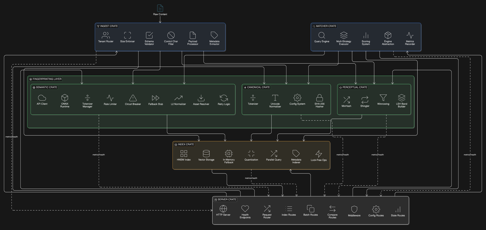
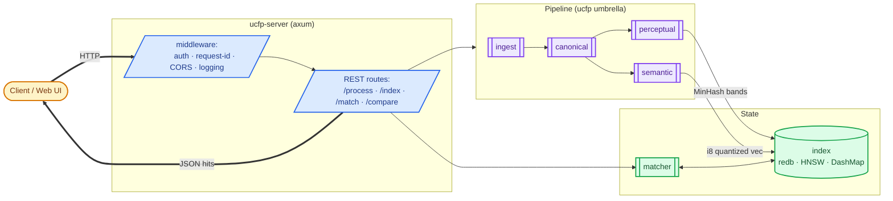
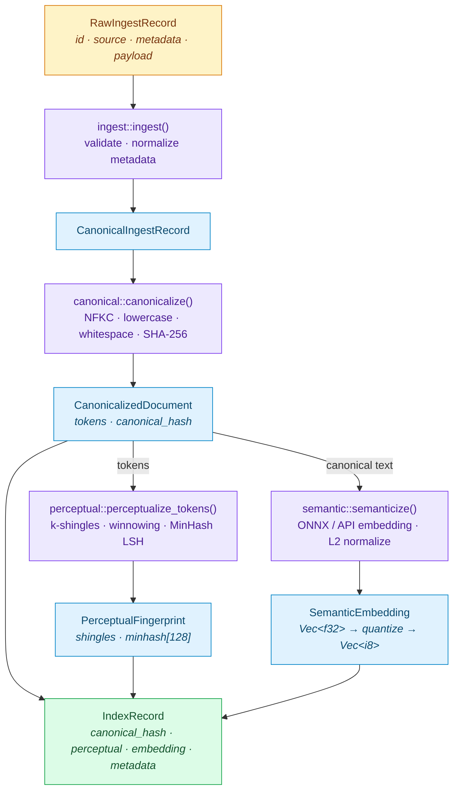
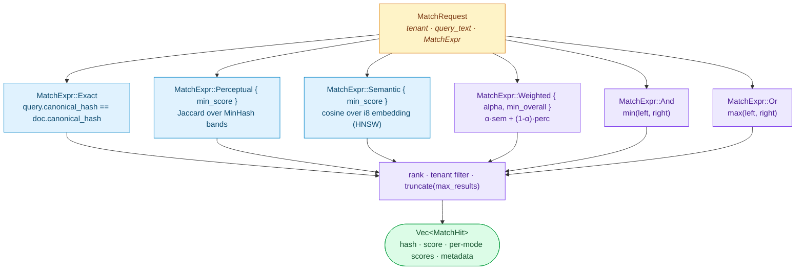
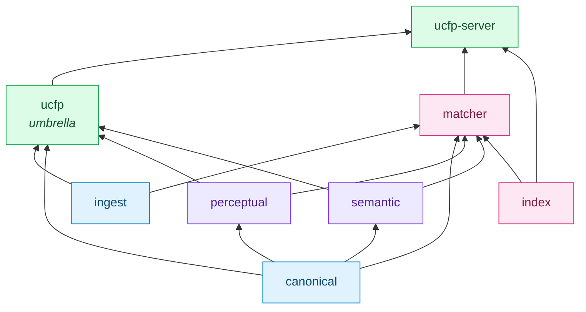

<div align="center">

# Universal Content Fingerprinting (UCFP)

**Deterministic, reproducible content fingerprints for text, audio, image, video, and documents**

[](https://www.rust-lang.org/)
[](https://github.com/bravo1goingdark/ucfp/actions)
[](LICENSE)
[](https://github.com/bravo1goingdark/ucfp/stargazers)

</div>

UCFP is a Rust framework that unifies **exact hashing**, **perceptual similarity**, and **semantic embeddings** into a single pipeline.

Traditional hashes fail when content changes slightly. Semantic search requires understanding beyond byte matching. UCFP gives you both—exact matches and meaning-based similarity—in one deterministic pipeline.

- **Deduplication** — Find exact and near-duplicate content
- **Plagiarism Detection** — Identify paraphrased text
- **Content Provenance** — Track content across systems
- **Similarity Search** — Search by meaning, not just keywords

## Quickstart

**Prerequisites**: Rust 1.88+ (`rustup toolchain install stable`)

```bash
# Build & test
cargo test                    # default features
cargo test --features full    # everything: every algorithm + multi-tenant

# Run the HTTP server (single-token, self-host)
UCFP_TOKEN=dev-secret \
UCFP_DATA_DIR=./data \
cargo run --bin ucfp
```

### Server env-var matrix

The `ucfp` binary picks one auth source, one rate limiter, and one usage sink at startup. It refuses to start unless at least one of the three auth-source vars is set.

| Concern | Var | Effect |
|---|---|---|
| Auth | `UCFP_TOKEN` | `StaticSingleKey` — single shared bearer, `tenant_id = 0` (legacy compat) |
| Auth | `UCFP_KEYS_FILE=/path/keys.toml` | `StaticMapKey` — multi-tenant from a TOML file |
| Auth | `UCFP_KEY_LOOKUP_URL` | `WebhookKeyLookup` — POST `{key}` to a control plane (requires `multi-tenant`) |
| Rate limit | `UCFP_RATELIMIT_URL` | `WebhookRateLimiter` (requires `multi-tenant`) |
| Rate limit | unset | `InMemoryTokenBucket` (100 rps × 200 burst) |
| Usage | `UCFP_USAGE_WEBHOOK_URL` | `WebhookUsageSink` — batched POSTs (requires `multi-tenant`) |
| Usage | `UCFP_USAGE_LOG_PATH` | `LogUsageSink` — NDJSON file append |
| Usage | neither | `NoopUsageSink` |
| Other | `UCFP_BIND` | listen address (default `0.0.0.0:8080`) |
| Other | `UCFP_DATA_DIR` | redb file directory (default `./data`) |
| Other | `UCFP_BODY_LIMIT_MB` | request body cap (default 16 MiB) |

See [`docs/ARCHITECTURE.md` §9](docs/ARCHITECTURE.md#9-multi-tenant-auth--quota) for the trait shapes (`ApiKeyLookup`, `TenantRateLimiter`, `UsageSink`), the `router_with_state` constructor, and the full request-lifecycle diagram.

### Catalog schema migration: v1 → v2

The embedded backend's metadata catalog moved from rkyv-archived rows (v1) to JSON-encoded rows (v2) to drop the rkyv dependency from the read path and unblock the new `GET /v1/records/{tid}/{rid}` describe endpoint. **Pre-existing redb databases written by v1 cannot be read directly by v2.** The migration path is to re-ingest: delete `data/ucfp.redb`, restart the server, replay your records through the modality ingest routes. There is no in-place migration tool — at v0.x scale the cost of re-fingerprinting is lower than maintaining a converter.

## Usage

```rust
use ucfp::{
    CanonicalizeConfig, IngestConfig, IngestPayload, IngestSource,
    PerceptualConfig, RawIngestRecord, PipelineStageConfig, process_pipeline,
};

let record = RawIngestRecord {
    id: "demo".into(),
    source: IngestSource::RawText,
    payload: Some(IngestPayload::Text("Hello world".into())),
    ..Default::default()
};

let (doc, fingerprint, _) = process_pipeline(
    record,
    PipelineStageConfig::Perceptual,
    &IngestConfig::default(),
    &CanonicalizeConfig::default(),
    Some(&PerceptualConfig::default()),
    None,
)?;

println!("Canonical hash: {}", doc.canonical_hash);
println!("MinHash bands: {}", fingerprint.unwrap().minhash_bands.len());
```

See [`examples/`](examples/) for full pipeline demonstrations.

## Full Pipeline Example

Complete workflow from ingest to matching:

```rust
use ucfp::{
    CanonicalizeConfig, IngestConfig, IngestMetadata, IngestPayload, IngestSource,
    PerceptualConfig, RawIngestRecord, SemanticConfig, PipelineStageConfig,
    process_pipeline,
};
use ucfp_index::{BackendConfig, IndexConfig, IndexRecord, UfpIndex};
use ucfp_matcher::{Matcher, MatchConfig, MatchRequest};

// 1. Configure all stages
let ingest_cfg = IngestConfig::default();
let canonical_cfg = CanonicalizeConfig::default();
let perceptual_cfg = PerceptualConfig::default();
let semantic_cfg = SemanticConfig::default();

// 2. Create index
let index_cfg = IndexConfig::new().with_backend(BackendConfig::InMemory);
let index = UfpIndex::new(index_cfg).unwrap();

// 3. Ingest a document
let record = RawIngestRecord {
    id: "doc-001".into(),
    source: IngestSource::RawText,
    metadata: IngestMetadata {
        tenant_id: Some("tenant-a".to_string()),
        doc_id: Some("my-doc".to_string()),
        ..Default::default()
    },
    payload: Some(IngestPayload::Text("Rust memory safety features".into())),
};

// 4. Process through pipeline (ingest -> canonical -> perceptual -> semantic)
let (doc, fingerprint, embedding) = process_pipeline(
    record,
    PipelineStageConfig::Perceptual,
    &ingest_cfg,
    &canonical_cfg,
    Some(&perceptual_cfg),
    Some(&semantic_cfg),
)?;

// 6. Store in index
let record = IndexRecord {
    doc_id: doc.doc_id.clone(),
    tenant_id: "tenant-a".to_string(),
    canonical_hash: doc.canonical_hash.clone(),
    perceptual_fingerprint: Some(fingerprint),
    semantic_embedding: Some(embedding),
    ..Default::default()
};
index.upsert(record)?;

// 7. Search with matcher
let matcher = Matcher::new(
    index,
    ingest_cfg,
    canonical_cfg,
    perceptual_cfg,
    semantic_cfg,
);

let req = MatchRequest {
    tenant_id: "tenant-a".to_string(),
    query_text: "Rust safety".to_string(),
    config: MatchConfig::default(),
    ..Default::default()
};

let hits = matcher.match_document(&req)?;
println!("Found {} matches", hits.len());
```

## Architecture

| Stage | Responsibility | Key Types |
|:------|:---------------|:----------|
| **ingest** | Validation, metadata normalization | `RawIngestRecord`, `CanonicalIngestRecord` |
| **canonical** | Unicode NFKC normalization, SHA-256 hashing | `CanonicalizedDocument` |
| **perceptual** | Rolling-hash shingles, winnowing, MinHash LSH | `PerceptualFingerprint` |
| **semantic** | Dense embeddings via ONNX | `SemanticEmbedding` |
| **index** | Storage with HNSW ANN search | `UfpIndex`, `QueryResult` |
| **match** | Query-time matching | `Matcher`, `MatchResult` |



### System Overview

How a request flows through the system, from the HTTP client down to storage and back:


```mermaid
flowchart LR
    classDef client fill:#fef3c7,stroke:#d97706,stroke-width:2px,color:#78350f
    classDef edge fill:#dbeafe,stroke:#2563eb,stroke-width:2px,color:#1e3a8a
    classDef pipe fill:#ede9fe,stroke:#7c3aed,stroke-width:2px,color:#4c1d95
    classDef store fill:#dcfce7,stroke:#16a34a,stroke-width:2px,color:#14532d

    Client([Client / Web UI]):::client

    subgraph Edge["ucfp-server (axum)"]
        direction TB
        MW[/"middleware:
        auth · request-id · CORS · logging"/]:::edge
        Routes[/"REST routes:
        /process · /index · /match · /compare"/]:::edge
        MW --> Routes
    end

    subgraph Pipe["Pipeline (ucfp umbrella)"]
        direction TB
        Ingest[[ingest]]:::pipe
        Canon[[canonical]]:::pipe
        Perc[[perceptual]]:::pipe
        Sem[[semantic]]:::pipe
        Ingest --> Canon --> Perc
        Canon --> Sem
    end

    subgraph Store["State"]
        direction TB
        Idx[("index<br/>redb · HNSW · DashMap")]:::store
        Match[[matcher]]:::store
    end

    Client ==>|HTTP| MW
    Routes --> Pipe
    Perc -->|MinHash bands| Idx
    Sem  -->|i8 quantized vec| Idx
    Routes --> Match
    Match <--> Idx
    Routes ==>|JSON hits| Client
```

### Pipeline Data Flow

Each stage produces a strongly-typed artifact that the next stage consumes. Perceptual and semantic branches are independent — either or both can be enabled per request:


```mermaid
flowchart TD
    classDef input  fill:#fef3c7,stroke:#d97706,color:#78350f
    classDef stage  fill:#ede9fe,stroke:#7c3aed,color:#4c1d95
    classDef artifact fill:#e0f2fe,stroke:#0284c7,color:#0c4a6e
    classDef output fill:#dcfce7,stroke:#16a34a,color:#14532d

    Raw["RawIngestRecord<br/><i>id · source · metadata · payload</i>"]:::input

    Ingest["ingest::ingest()<br/>validate · normalize metadata"]:::stage
    CanonStep["canonical::canonicalize()<br/>NFKC · lowercase · whitespace · SHA-256"]:::stage
    PercStep["perceptual::perceptualize_tokens()<br/>k-shingles · winnowing · MinHash LSH"]:::stage
    SemStep["semantic::semanticize()<br/>ONNX / API embedding · L2 normalize"]:::stage

    CIR["CanonicalIngestRecord"]:::artifact
    Doc["CanonicalizedDocument<br/><i>tokens · canonical_hash</i>"]:::artifact
    FP["PerceptualFingerprint<br/><i>shingles · minhash[128]</i>"]:::artifact
    Emb["SemanticEmbedding<br/><i>Vec&lt;f32&gt; → quantize → Vec&lt;i8&gt;</i>"]:::artifact

    IR["IndexRecord<br/><i>canonical_hash · perceptual · embedding · metadata</i>"]:::output

    Raw --> Ingest --> CIR --> CanonStep --> Doc
    Doc -->|tokens| PercStep --> FP
    Doc -->|canonical text| SemStep --> Emb
    Doc  --> IR
    FP   --> IR
    Emb  --> IR
```

### Match Strategies

`MatchExpr` is a composable tree — leaves run against the index, inner nodes combine scores:


```mermaid
flowchart TD
    classDef q fill:#fef3c7,stroke:#d97706,color:#78350f
    classDef leaf fill:#e0f2fe,stroke:#0284c7,color:#0c4a6e
    classDef combine fill:#ede9fe,stroke:#7c3aed,color:#4c1d95
    classDef out fill:#dcfce7,stroke:#16a34a,color:#14532d

    Q["MatchRequest<br/><i>tenant · query_text · MatchExpr</i>"]:::q

    Exact["MatchExpr::Exact<br/>query.canonical_hash == doc.canonical_hash"]:::leaf
    Perc["MatchExpr::Perceptual { min_score }<br/>Jaccard over MinHash bands"]:::leaf
    Sem["MatchExpr::Semantic { min_score }<br/>cosine over i8 embedding (HNSW)"]:::leaf
    Weight["MatchExpr::Weighted { alpha, min_overall }<br/>α·sem + (1-α)·perc"]:::combine
    And["MatchExpr::And<br/>min(left, right)"]:::combine
    Or["MatchExpr::Or<br/>max(left, right)"]:::combine

    Rank["rank · tenant filter · truncate(max_results)"]:::combine
    Hits(["Vec&lt;MatchHit&gt;<br/>hash · score · per-mode scores · metadata"]):::out

    Q --> Exact
    Q --> Perc
    Q --> Sem
    Q --> Weight
    Q --> And
    Q --> Or
    Exact  --> Rank
    Perc   --> Rank
    Sem    --> Rank
    Weight --> Rank
    And    --> Rank
    Or     --> Rank
    Rank --> Hits
```

### Crate Layering

The workspace is strictly layered — no cycles. Lower crates know nothing of higher ones:


```mermaid
flowchart BT
    classDef foundation fill:#e0f2fe,stroke:#0284c7,color:#0c4a6e
    classDef feature fill:#ede9fe,stroke:#7c3aed,color:#4c1d95
    classDef glue fill:#fce7f3,stroke:#db2777,color:#831843
    classDef top fill:#dcfce7,stroke:#16a34a,color:#14532d

    ingest[ingest]:::foundation
    canonical[canonical]:::foundation

    perceptual[perceptual]:::feature
    semantic[semantic]:::feature

    index[index]:::glue
    matcher[matcher]:::glue

    ucfp[ucfp<br/><i>umbrella</i>]:::top
    server[ucfp-server]:::top

    canonical --> perceptual
    canonical --> semantic
    ingest    --> ucfp
    canonical --> ucfp
    perceptual --> ucfp
    semantic   --> ucfp
    ingest    --> matcher
    canonical --> matcher
    perceptual --> matcher
    semantic  --> matcher
    index     --> matcher
    ucfp      --> server
    matcher   --> server
    index     --> server
```

### Request Lifecycle: `POST /api/v1/match`

A traced view of a single match request — useful for understanding latency hotspots:

```mermaid
sequenceDiagram
    autonumber
    participant C as Client
    participant MW as Middleware<br/>(auth · request-id · rate limit)
    participant R as Route<br/>matching::match_documents
    participant M as Matcher
    participant P as Pipeline<br/>(ingest → canonical → sem/perc)
    participant I as UfpIndex<br/>(HNSW + DashMap)

    C->>MW: POST /api/v1/match + X-API-Key
    MW->>MW: validate key · tag request-id
    MW->>R: forward
    R->>M: MatchRequest { tenant, query_text, MatchExpr }

    rect rgba(237,233,254,0.4)
        note over M,P: query → fingerprint
        M->>P: build RawIngestRecord(query_text)
        P->>P: ingest · canonicalize · (perceptual | semantic)
        P-->>M: CanonicalizedDocument + FP / Embedding
    end

    rect rgba(224,242,254,0.4)
        note over M,I: index lookup
        M->>I: query_perceptual(fp)
        I-->>M: Vec&lt;QueryResult&gt;
        M->>I: query_semantic(quantized_vec)
        I-->>M: Vec&lt;QueryResult&gt;
    end

    M->>M: score · tenant filter · rank · truncate
    M-->>R: Vec&lt;MatchHit&gt;
    R-->>MW: JSON response
    MW-->>C: 200 OK + hits
```

## Configuration

```yaml
version: "1.0"

ingest:
  default_tenant_id: "acme-corp"
  max_payload_bytes: 10485760

canonical:
  normalize_unicode: true
  lowercase: true

perceptual:
  k: 9              # shingle size
  w: 4              # winnow window
  minhash_bands: 16

semantic:
  tier: "balanced"
  enable_chunking: true  # For documents > 512 tokens

index:
  backend: "redb"
  ann:
    enabled: true
    min_vectors_for_ann: 1000
```

Load in code:
```rust
use ucfp::config::UcfpConfig;
let config = UcfpConfig::from_file("config.yaml")?;
```

## Performance

| Stage | Latency | Notes |
|:------|:--------|:------|
| `ingest` | ~45 μs | Validation + metadata |
| `canonical` | ~180 μs | Unicode NFKC + SHA-256 |
| `perceptual` | ~180 μs | Parallel MinHash LSH |
| `semantic` | ~8.5 ms | ONNX embedding |
| `index` | ~50 μs | Lock-free DashMap |
| `match` | ~50-450 μs | ANN O(log n) at >1K vectors |

**Optimizations**: Lock-free concurrency, parallel MinHash, HNSW ANN search, HTTP/2 connection pooling, SIMD vector operations.

Disable semantic stage for ~100 μs/doc when exact + perceptual matching is sufficient.

## API

REST API server included. Quick example:

```bash
curl -X POST http://localhost:8080/api/v1/process \
  -H "Content-Type: application/json" \
  -H "X-API-Key: your-api-key" \
  -d '{
    "text": "Your document content...",
    "enable_semantic": true
  }'
```

**API Limits:**
- Maximum text size: **10 MB** per document
- Maximum batch size: **1000 documents**

See [`crates/server/API.md`](crates/server/API.md) for full API reference.

## Roadmap

| Modality | Status | Canonicalizer | Fingerprint | Embedding |
|:---------|:-------|:--------------|:------------|:----------|
| **Text** | Ready | NFKC + tokenization | MinHash | BGE / E5 |
| **Image** | Planned | DCT normalization | pHash | CLIP / SigLIP |
| **Audio** | Planned | Mel-spectrogram | Winnowing | SpeechCLIP / Whisper |
| **Video** | Planned | Keyframes | Scene hashes | VideoCLIP / XCLIP |
| **Document** | Planned | OCR + layout | Layout graph | LayoutLMv3 |

## Development

```bash
./run-ci-local.sh  # Format, lint, test, build
```

See [CONTRIBUTING.md](CONTRIBUTING.md) for guidelines.

## License

Apache-2.0
